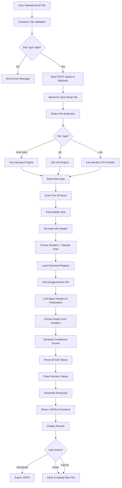

# 🚀 Intelligent Excel Parser - AI-Powered Data Mapping Agent

<div align="center">


**An intelligent AI-powered system that automatically parses messy Excel files and maps them to a canonical parameter registry using Google's Gemini AI.**

[Features](#-features) • [Architecture](#-architecture) • [Installation](#-installation) • [Usage](#-usage) • [API Documentation](#-api-documentation)

</div>

---

## 📋 Table of Contents

- [Overview](#-overview)
- [Features](#-features)
- [Architecture](#-architecture)
- [System Flow](#-system-flow)
- [Tech Stack](#-tech-stack)
- [Project Structure](#-project-structure)
- [Installation](#-installation)
- [Usage](#-usage)
- [API Documentation](#-api-documentation)
- [Frontend Features](#-frontend-features)
- [Backend Features](#-backend-features)
- [Configuration](#-configuration)
- [Deployment](#-deployment)
- [Contributing](#-contributing)
- [License](#-license)

---

## 🎯 Overview

The **Intelligent Excel Parser** is a full-stack application that solves the problem of inconsistent Excel spreadsheet formats in industrial data management. Factories upload monthly operational data with varying column names, embedded assets, different value formats, and unpredictable metadata rows. This system uses AI to intelligently parse, map, and extract structured data from these messy Excel files.

### Problem Statement

- **Inconsistent Headers**: Column names vary across files (e.g., "Coal Consumption", "COAL CONSMPTN", "Daily Coal")
- **Asset Embedding**: Assets are embedded in headers (e.g., "Coal Consumption AFBC-1")
- **Format Variations**: Values come in different formats ("1,234.56", "45%", "YES", "N/A")
- **Metadata Rows**: Title rows and empty rows appear unpredictably

### Solution

This system provides:
- ✅ Automatic header detection
- ✅ AI-powered column-to-parameter mapping
- ✅ Asset extraction from headers
- ✅ Intelligent value parsing
- ✅ Confidence scoring
- ✅ Unmapped column flagging

---

## ✨ Features

### Core Features

- **🤖 AI-Powered Mapping**: Uses Google Gemini 2.5 Flash to intelligently map messy headers to canonical parameters
- **📊 Automatic Header Detection**: Automatically finds header rows, skipping title rows and metadata
- **🏭 Asset Detection**: Extracts asset names from column headers (e.g., "Boiler 1", "AFBC-1")
- **🔢 Value Parsing**: Converts various formats to numeric values:
  - `"1,234.56"` → `1234.56`
  - `"45%"` → `0.45`
  - `"YES"` → `1.0`
  - `"N/A"` → `null`
- **📈 Confidence Scoring**: Each mapping includes confidence level (high/medium/low)
- **⚠️ Unmapped Column Detection**: Flags columns that don't match any canonical parameter
- **🎨 Modern UI**: Beautiful, responsive Next.js frontend with drag-and-drop file upload

### Advanced Features

- **🔄 Real-time Processing**: Fast file processing with progress indicators
- **📥 JSON Export**: Download parsed data as structured JSON
- **🔄 Reset Functionality**: Easy file cancellation and reset
- **🌐 CORS Enabled**: Ready for cross-origin requests
- **🐳 Docker Support**: Containerized deployment with docker-compose

---

## 🏗️ Architecture

### System Architecture

At a high level, the system is a **Next.js client** talking to a **FastAPI backend**, which in turn calls **Google Gemini** and uses a local **canonical registry JSON** for context.\n+
```mermaid\ngraph LR\n  A[Browser / Next.js Frontend<br/>port 3000] -->|POST /parse<br/>GET /health| B[FastAPI Backend<br/>port 8000]\n  B -->|LLM call| C[Google Gemini 2.5 Flash]\n  B --> D[Canonical Registry<br/>canonical_registry.json]\n  B -->|Structured JSON<br/>APIResponse| A\n```

---

## 🔄 System Flow

## 🎥 Demo Video

<div align="center">

### Watch the Demo

<!-- GitHub will show this as a downloadable link; some browsers may also play it inline -->
[📹 Download / View Demo Video](demo.mp4)

</div>

### Processing Flowchart



---

## 🛠️ Tech Stack

### Frontend
- **Framework**: Next.js 16.1.6
- **Language**: TypeScript 5.0+
- **Styling**: Tailwind CSS 4.0
- **UI Components**: 
  - React Dropzone (file upload)
  - Lucide React (icons)
- **HTTP Client**: Axios
- **Build Tool**: Next.js built-in

### Backend
- **Framework**: FastAPI 0.111.0
- **Language**: Python 3.11+
- **Server**: Uvicorn 0.30.1
- **Data Processing**: 
  - Pandas 2.2.2
  - openpyxl 3.1.5 (for .xlsx files)
  - xlrd 2.0.1+ (for .xls files)
- **AI Integration**: Google Genai SDK 0.6.0
- **Validation**: Pydantic 2.7.4
- **Environment**: python-dotenv 1.0.1

### DevOps
- **Containerization**: Docker & Docker Compose
- **Version Control**: Git
- **Package Management**: 
  - npm (frontend)
  - pip (backend)

---

## 📁 Project Structure

```
intelligent-excel-parser/
│
├── backend/                    # Backend API Server
│   ├── __pycache__/           # Python cache
│   ├── main.py                # FastAPI application & routes
│   ├── mapping_engine.py      # Core parsing & mapping logic
│   ├── models.py              # Pydantic data models
│   ├── canonical_registry.json # Parameter registry
│   ├── requirements.txt       # Python dependencies
│   └── Dockerfile             # Backend container config
│
├── frontend/                   # Next.js Frontend
│   ├── src/
│   │   └── app/
│   │       ├── page.tsx       # Main UI component
│   │       ├── layout.tsx     # Root layout
│   │       └── globals.css    # Global styles
│   ├── public/                # Static assets
│   ├── package.json           # Node dependencies
│   ├── next.config.ts         # Next.js configuration
│   ├── tsconfig.json          # TypeScript config
│   └── Dockerfile             # Frontend container config
│
├── frontend-python/            # Legacy Streamlit frontend (optional)
│   ├── app.py
│   ├── requirements.txt
│   └── Dockerfile
│
├── sample_clean.xlsx           # Test data
├── sample_messy_1.xlsx         # Test data
├── sample_messy_2.xlsx        # Test data
├── sample_extreme_mess.xlsx   # Test data
│
├── docker-compose.yml          # Multi-container orchestration
├── .env                        # Environment variables (not in repo)
├── .env.example               # Environment template
├── .gitignore                 # Git ignore rules
├── README.md                   # This file
└── start-backend.sh           # Backend startup script
```

---

## 🚀 Installation

### Prerequisites

- **Node.js** 20+ and npm
- **Python** 3.11+
- **Docker** and Docker Compose (optional, for containerized deployment)
- **Google Gemini API Key** ([Get one here](https://makersuite.google.com/app/apikey))

### Option 1: Docker Deployment (Recommended) 🐳

**Quick Start with Docker Compose:**

```bash
# 1. Clone the repository
git clone https://github.com/Ujjwal120605/Intelligent-Excel-Parser.git
cd Intelligent-Excel-Parser

# 2. Set up environment variables
cp .env.example .env
# Edit .env and add your GEMINI_API_KEY

# 3. Start all services
docker-compose up --build

# Or run in detached mode
docker-compose up --build -d
```

**Access the application:**
- 🌐 **Frontend UI**: http://localhost:3000
- 🔌 **Backend API**: http://localhost:8000
- 📚 **API Documentation**: http://localhost:8000/docs
- ❤️ **Health Check**: http://localhost:8000/health

**Useful Docker Commands:**
```bash
# View running containers
docker-compose ps

# View logs
docker-compose logs -f

# Stop containers
docker-compose down

# Restart containers
docker-compose restart

# Rebuild after code changes
docker-compose up --build -d
```

**Docker Images:**
- Backend: Built from `backend/Dockerfile` (Python 3.11 + FastAPI)
- Frontend: Built from `frontend/Dockerfile` (Node.js 20 + Next.js)

### Option 2: Local Development

#### Backend Setup

```bash
# Navigate to backend directory
cd backend

# Create virtual environment
python3 -m venv venv
source venv/bin/activate  # On Windows: venv\Scripts\activate

# Install dependencies
pip install -r requirements.txt

# Set environment variable
export GEMINI_API_KEY="your-api-key-here"

# Run server
cd ..
export PYTHONPATH=$(pwd)
cd backend
python -m uvicorn main:app --host 0.0.0.0 --port 8000 --reload
```

#### Frontend Setup

```bash
# Navigate to frontend directory
cd frontend

# Install dependencies
npm install

# Run development server
npm run dev
```

---

## 📖 Usage

### Using the Web Interface

1. **Open the application** at http://localhost:3000
2. **Upload a file**:
   - Drag and drop an Excel file onto the upload area, or
   - Click to browse and select a file
3. **Click "ANALYZE DATA"** to process the file
4. **Review results**:
   - View parsed data in the table
   - Check warnings and unmapped columns
   - Review confidence scores
5. **Download JSON** to export the parsed data
6. **Reset** to upload a new file

### Using the API Directly

#### Parse an Excel File

```bash
curl -X POST "http://localhost:8000/parse" \
  -H "accept: application/json" \
  -H "Content-Type: multipart/form-data" \
  -F "file=@sample_messy_1.xlsx"
```

#### Health Check

```bash
curl http://localhost:8000/health
```

---

## 📚 API Documentation

### Endpoints

#### `POST /parse`

Parses an uploaded Excel file and returns structured data.

**Request:**
- **Method**: POST
- **Content-Type**: multipart/form-data
- **Body**: 
  - `file`: Excel file (.xlsx, .xls, or .csv)

**Response:**
```json
{
  "status": "success",
  "header_row": 2,
  "parsed_data": [
    {
      "row": 3,
      "col": 0,
      "param_name": "coal_consumption",
      "asset_name": "AFBC-1",
      "raw_value": "1,234.56",
      "parsed_value": 1234.56,
      "confidence": "high"
    }
  ],
  "unmapped_columns": [
    {
      "col": 5,
      "header": "Comments",
      "reason": "No matching parameter found in canonical registry"
    }
  ],
  "warnings": [
    "Skipped 1 title/metadata rows to find headers."
  ]
}
```

#### `GET /health`

Health check endpoint.

**Response:**
```json
{
  "status": "healthy",
  "service": "LatSpace Data Mapping Agent"
}
```

### Interactive API Documentation

Visit http://localhost:8000/docs for interactive Swagger UI documentation.

---

## 🎨 Frontend Features

### User Interface Components

1. **File Upload Area**
   - Drag & drop support
   - File type validation
   - Visual feedback

2. **Results Display**
   - Parsed data table with:
     - Row and column indices
     - Parameter names
     - Asset names
     - Raw and parsed values
     - Confidence badges
   - Warnings section
   - Unmapped columns table

3. **Action Buttons**
   - **ANALYZE DATA**: Process uploaded file
   - **DOWNLOAD JSON**: Export results
   - **RESET**: Clear and start over
   - **Cancel (X)**: Remove selected file

### State Management

- File selection state
- Loading state with spinner
- Error handling with user-friendly messages
- Results persistence

---

## ⚙️ Backend Features

### Core Processing Logic

#### 1. File Reading (`mapping_engine.py`)

```python
def process_excel_file(file_path: str) -> dict:
    # Detects file type and uses appropriate engine
    file_ext = os.path.splitext(file_path)[1].lower()
    
    if file_ext in ['.xlsx', '.xlsm']:
        df = pd.read_excel(file_path, engine="openpyxl")
    elif file_ext == '.xls':
        df = pd.read_excel(file_path, engine="xlrd")
    # ... CSV handling
```

#### 2. Header Detection

- Scans first 20 rows
- Finds row with most string values
- Handles duplicate headers automatically

#### 3. AI Mapping

- Sends headers + sample data to Google Gemini
- Uses structured output for reliable JSON
- Maps to canonical registry
- Extracts assets from headers

#### 4. Value Parsing

```python
def clean_numeric_value(val: any) -> float | None:
    # Handles various formats:
    # "1,234.56" → 1234.56
    # "45%" → 0.45
    # "YES" → 1.0
    # "N/A" → None
```

### Error Handling

- File type validation
- Engine fallback (openpyxl → xlrd → CSV)
- Encoding fallback (UTF-8 → latin1)
- Comprehensive error messages

---

## 🔧 Configuration

### Environment Variables

Create a `.env` file in the root directory:

```env
GEMINI_API_KEY=your_google_gemini_api_key_here
```

### Canonical Registry

The `backend/canonical_registry.json` file contains the parameter registry:

```json
[
  {
    "parameter_name": "power_generation",
    "description": "Amount of electrical power generated.",
    "expected_units": ["MW", "kW", "kWh"]
  },
  {
    "parameter_name": "coal_consumption",
    "description": "Amount of coal consumed by the process.",
    "expected_units": ["MT", "kg", "tons"]
  }
]
```

### Frontend Configuration

The frontend uses environment variables for backend URL:

- Development: `http://localhost:8000`
- Docker: `http://backend:8000`
- Production: Set `NEXT_PUBLIC_BACKEND_URL` in environment

---

## 🚢 Deployment

### Docker Compose Deployment (Recommended)

The easiest way to deploy is using Docker Compose, which orchestrates both frontend and backend services:

```bash
# Build and start all services
docker-compose up --build -d

# View logs
docker-compose logs -f

# Stop services
docker-compose down
```

**Docker Compose Configuration:**
- `docker-compose.yml` - Orchestrates backend and frontend services
- `backend/Dockerfile` - Backend container configuration
- `frontend/Dockerfile` - Frontend container configuration

**Ports:**
- Frontend: `3000`
- Backend: `8000`

### Publishing to Docker Hub (Optional)

If you want to publish your Docker images to Docker Hub:

```bash
# 1. Login to Docker Hub
docker login

# 2. Build and tag images
docker build -t yourusername/intelligent-excel-parser-backend:latest -f backend/Dockerfile .
docker build -t yourusername/intelligent-excel-parser-frontend:latest -f frontend/Dockerfile .

# 3. Push to Docker Hub
docker push yourusername/intelligent-excel-parser-backend:latest
docker push yourusername/intelligent-excel-parser-frontend:latest
```

Then others can pull and run:
```bash
docker pull yourusername/intelligent-excel-parser-backend:latest
docker pull yourusername/intelligent-excel-parser-frontend:latest
```

### Production Deployment

#### Backend (Render.com / Railway / Heroku)

1. Set environment variable: `GEMINI_API_KEY`
2. Build command: `pip install -r requirements.txt`
3. Start command: `uvicorn main:app --host 0.0.0.0 --port $PORT`

#### Frontend (Vercel / Netlify)

1. Set environment variable: `NEXT_PUBLIC_BACKEND_URL`
2. Build command: `npm run build`
3. Start command: `npm start`

---

## 🧪 Testing

### Test Files Included

- `sample_clean.xlsx` - Clean headers, baseline test
- `sample_messy_1.xlsx` - Abbreviated headers, mixed formats
- `sample_messy_2.xlsx` - Additional messy data
- `sample_extreme_mess.xlsx` - Complex edge cases

### Manual Testing

1. Upload each test file
2. Verify header detection
3. Check parameter mapping accuracy
4. Validate value parsing
5. Review confidence scores

---

## 🤝 Contributing

Contributions are welcome! Please follow these steps:

1. Fork the repository
2. Create a feature branch (`git checkout -b feature/AmazingFeature`)
3. Commit your changes (`git commit -m 'Add some AmazingFeature'`)
4. Push to the branch (`git push origin feature/AmazingFeature`)
5. Open a Pull Request

### Development Guidelines

- Follow PEP 8 for Python code
- Use TypeScript for frontend
- Write clear commit messages
- Add comments for complex logic
- Update documentation as needed

---

## 📝 License

This project is licensed under the MIT License - see the LICENSE file for details.

---

## 👤 Author

**Ujjwal Bajpai**

- GitHub: [@Ujjwal120605](https://github.com/Ujjwal120605)
- Project: [Intelligent Excel Parser](https://github.com/Ujjwal120605/Intelligent-Excel-Parser)

---

## 🙏 Acknowledgments

- Google Gemini AI for intelligent mapping capabilities
- FastAPI for the excellent async framework
- Next.js for the powerful React framework
- Pandas for robust data processing

---

## 📊 Project Status

✅ **Core Features**: Complete  
✅ **Frontend**: Complete  
✅ **Backend**: Complete  
✅ **Docker Support**: Complete  
✅ **Documentation**: Complete  

**Ready for Production Use!** 🎉

---

<div align="center">

**Made with ❤️ using FastAPI, Next.js, and Google Gemini AI**

⭐ Star this repo if you find it helpful!

</div>
